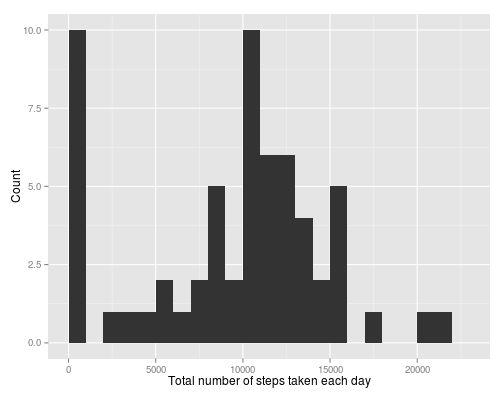
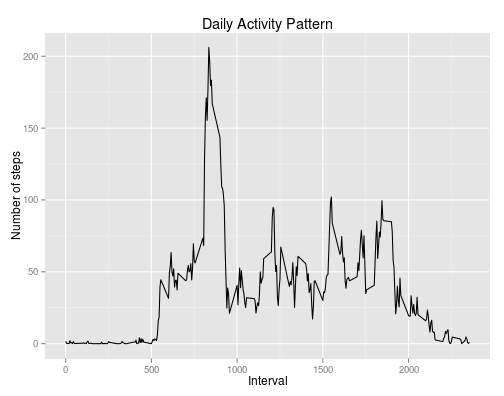
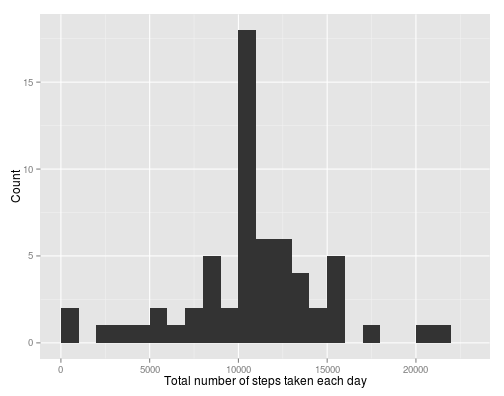
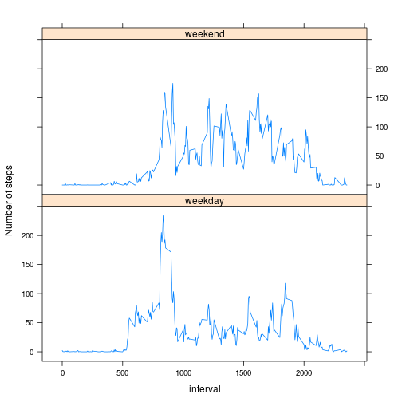

# Reproducible Research: Peer Assessment 1


## Loading and preprocessing the data
First, we will load and preprocess the data

```r
data <- read.csv("activity.csv", colClasses = c("numeric", "character", "numeric"))
data$date <- as.Date(data$date)
data$interval <- as.factor(data$interval)
```

The whole dataset contains **17568 observations** and **3 variables**. Here is the structure of the data

```r
str(data)
```

```
## 'data.frame':	17568 obs. of  3 variables:
##  $ steps   : num  NA NA NA NA NA NA NA NA NA NA ...
##  $ date    : Date, format: "2012-10-01" "2012-10-01" ...
##  $ interval: Factor w/ 288 levels "0","5","10","15",..: 1 2 3 4 5 6 7 8 9 10 ...
```

Let's load the libraries needed for this work

```r
library(ggplot2)
library(lattice)
```


## What is mean total number of steps taken per day?
Let's take a look at the total number of steps taken each day

```r
tstep <- tapply(data$steps, data$date, sum, na.rm = TRUE)
qplot(tstep, geom = "histogram", binwidth = 1000, xlim = c(0, 23000)) + xlab("Total number of steps taken each day") + 
    ylab("Count")
```

 

The **mean** and **median** total number of steps taken per day are respectively 
* mean = 9354.2295 
* median = 1.0395 &times; 10<sup>4</sup>

## What is the average daily activity pattern?

```r
pat <- tapply(data$steps, data$interval, mean, na.rm = TRUE)
xpat <- as.numeric(names(pat))
qplot(xpat, pat, geom = "line") + xlab("Interval") + ylab("Number of steps") + 
    ggtitle("Daily Activity Pattern")
```

 

And as

```r
indmax <- which.max(pat)
xpat[indmax]
```

```
## [1] 835
```

So the **835** 5-minute interval, on average across all the days in the dataset, contains the maximum number of steps.


## Imputing missing values

The total number of missing values in the dataset is **2304**.
We could fill the missing values with the mean of that 5-minute interval as following

```r
ndata <- data
ndata$steps[is.na(ndata$steps)] <- pat[ndata$interval[is.na(ndata$steps)]]
```

The new dataset `ndata`  is equal to the original dataset `data` but with the missing data filled in. We can then make a histogram of the total number of steps taken each day

```r
ntstep <- tapply(ndata$steps, ndata$date, sum)
qplot(ntstep, geom = "histogram", binwidth = 1000, xlim = c(0, 23000)) + xlab("Total number of steps taken each day") + 
    ylab("Count")
```

 


The **mean** and **median** total number of steps taken per day are respectively 
* mean = 1.0766 &times; 10<sup>4</sup> 
* median = 1.0766 &times; 10<sup>4</sup>

We notice that these values are different from the estimates of the first part with missing values. Imputing the missing data on the estimates makes the distribution less skewed and more centered.

## Are there differences in activity patterns between weekdays and weekends?
The activity during the weekdays and the weekend are as following


```r
weekend <- (weekdays(ndata$date) == "Saturday" | weekdays(ndata$date) == "Sunday")

patwkday <- tapply(data$steps[!weekend], data$interval[!weekend], mean, na.rm = T)
patwkend <- tapply(data$steps[weekend], data$interval[weekend], mean, na.rm = T)

wkgl <- gl(n = 2, k = length(patwkend), labels = c("weekday", "weekend"))
dd <- data.frame(interval = as.numeric(names(patwkend)), val = c(patwkday, patwkend), 
    wk = wkgl)

xyplot(val ~ interval | wk, data = dd, type = "l", ylab = "Number of steps", 
    layout = c(1, 2))
```

 

We note that the activity of the users spread all along the day during the weekend while during the work days, there is not so much movement.


